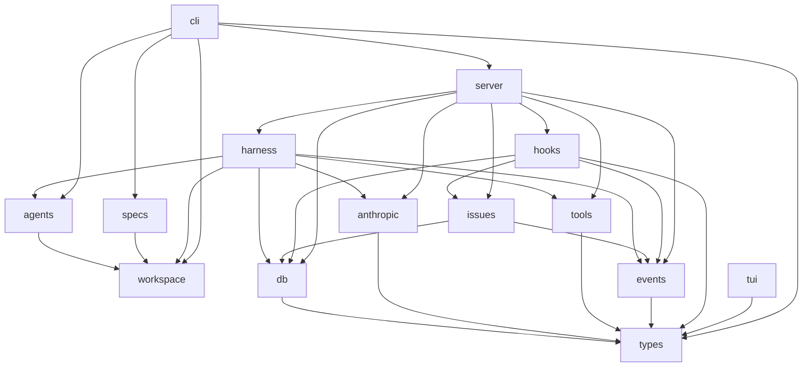

---
targets:
  - Cargo.toml
  - crates/*/Cargo.toml
verified: 2026-05-06T18:50:22Z
---

# Architecture Spec

## Design Principles

Flat set of crates, each owning one layer. Dependencies are a directed acyclic graph — any crate can be understood, tested, and replaced without reading the others.

**Do not add dependencies to a crate's `Cargo.toml` to work around an architectural boundary.** Adding a dep to the wrong crate is a violation, not a shortcut.

**Crates that own an external dependency boundary (database, HTTP) must not expose their concrete implementation types.** Use `pub(crate)` for types like `SqliteDb`, `SqliteHookStore`, etc. and expose only traits and factory functions. Upper-layer crates must couple to abstractions, not implementations. A factory function (e.g. `db::connect() -> (Arc<dyn Db>, Arc<dyn HookStore>)`) is the correct seam.

When adding a substantial new unit of responsibilities or business logic, consider whether a new crate should be created instead of adding it to an existing one.

## Dependency Graph

Arrows point from dependent to dependency.

> **Known violations (tracked):** `hooks` depends on `issues` — reaches across layer boundaries. Tracked in GH#98.

## Crates

**`types`** — shared domain types: `Session`, `Turn`, `ContentBlock`, `Issue`, tool shapes. No behavior.

**`db`** — SQLite access via sqlx. Owns schema, migrations, and every query.
_Doesn't own: SQL written anywhere else._

**`anthropic`** — HTTP client for the Anthropic Messages API. Streaming SSE parsing, request/response types.

**`tools`** — `Tool` trait plus `bash`, `read`, `write`, `edit` implementations.
_Doesn't own: session or turn state._

**`workspace`** — git worktree management and `git_root()` discovery.

**`agents`** — reads/writes `.ns2/agents/*.md` agent definition files.

**`specs`** — reads/writes `.spec.md` files; staleness checking.

**`events`** — global event bus. Defines `SystemEvent` (the top-level envelope), `SessionEvent` (turn-level harness events), and `IssueEvent` (issue lifecycle events). `EventBus` is a cheaply-cloneable `tokio::broadcast` wrapper; `send` is fire-and-forget.

**`harness`** — agent turn loop. Context window construction, system prompt loading, tool dispatch, worktree resolution. Publishes `SystemEvent::Session` events to the `EventBus`; one instance per active session.
_Doesn't own: issue lifecycle or state transitions — that's `issues`. No HTTP._

**`issues`** — pure issue domain service. Owns the state machine (open → running → completed/failed/cancelled), `start_issue`, `complete_issue`, `reopen_issue`, `orphan_sweep`. Publishes `SystemEvent::Issue` events to the `EventBus`. Exposes `IssueService` and `StartIssueOutcome`.
_Doesn't own: HTTP routing, harness spawning, or session maps — those belong in `server`._

**`hooks`** — hook types, filter evaluation, and action dispatch. Defines `Hook`, `HookSource` (internal/external/timer), `HookAction` (SendMessage/CreateIssue/RunShell), and `HookFilter` (field conditions). A hook evaluator subscribes to the `EventBus` and dispatches actions when filters match.
_Known violation tracked in GH#98 (direct `issues` dep)._

**`server`** — axum HTTP server. Routes, `ServerConfig`, session maps, harness spawning. Holds an `EventBus` in `AppState` shared by all routes and the hook evaluator. Exposes `GET /events` as an SSE endpoint that replays session history from DB then streams live `SystemEvent`s with optional `session_id`, `issue_id`, and `types` filters. Constructs the Anthropic client, standard tools, and `spawn_harness_sync`. Delegates issue lifecycle to `IssueService` but owns all harness lifecycle.
_Doesn't own: issue business logic — delegate to `issues`._

**`tui`** — ratatui terminal UI. Connects to the server via SSE. Thin client: all state comes from the server.

**`cli`** — the `ns2` binary. Wires crates; contains no logic of its own. Depends directly on `server` to start the in-process server, and on `types` for shared domain types. Uses `reqwest` directly for HTTP calls to the local ns2 server (health checks, issue/session/hook CRUD, SSE streaming).
_Doesn't own: Anthropic client init or harness instantiation — that's `server`'s job._